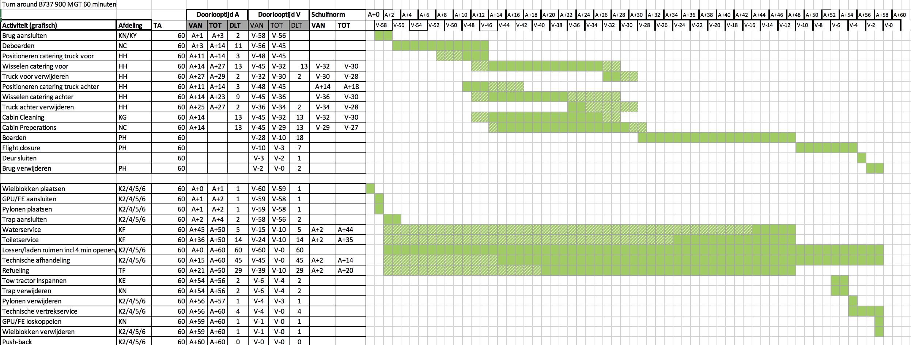

# Assignment

The goal of this assignment is to build a simple first version of a **Dependency Network API**.

#### What is a **dependency network**?

A **dependency network** is a set of rules that define the _earliest start_, _duration_ and _latest end_ of operational tasks
in the **turnaround** and the dependencies between those tasks.
The duration is not necessarily as long as the time between the earlist start and latest end (eg. sometimes slack is built into the design).
The dependency network is effectively a representation of the process design of ground services, as described in the Ground Operations Manuals (GOMS).
The _earliest start_ and _latest end_ can be defined in terms of number of minutes since the arrival the aircraft (eg. A+1, A+5, etc.)
or the number of minutes until the departure of the aircraft (eg. D-45, D-40, etc.)

If you visualize this in Excel, it would look like this for example:

And if you also visualize the _dependencies_ between tasks, you'd get something like this:

In actuality, multiple Dependency Networks exist, because the tasks in the turnaround and their dependencies differ between aircraft types.
Eg. a 777 requires different tasks to be completed during the turnaround than a 737.
**But for the purpose of this assignment we'll assume there is only one possible way to do a turnaround and so there's only 1 dependency network**

#### Dependency Network API

The **Dependency Network API** is a web API that allows dependency networks to be stored, accessed, and changed.
This happens quite often, as process designers are constantly trying to optimize the turnaround - and by extension all of its tasks.

The end-users of the **Dependency Network API** are:

- developers building a web application (e.g. in Angular) for these process designers.
- developers building optimization tools that need the dependency network as input
  (these only need to retrieve the dependency network, not make changes)

## Functional Requirements

The **Dependency Network API** has the following _functional requirements_:

- It stores tasks with their dependencies on other tasks. **For this assignment, it is not required to store these in a database.
  It is sufficient to keep them in memory**.
- The dependency network can be retrieved as a whole.
- Given a task, you can retrieve all other tasks it depends on (ie. _upstream tasks_).
- Given a task, you can retrieve all other tasks that are dependent on it (ie. _downstream tasks_).
- You can add a new task, including dependencies with other tasks.
- You can create new dependencies between existing tasks.
- You can delete tasks.
- You can remove dependencies between tasks.
- The dependency network (or parts of it) should be viewable/retrievable by anyone.
- Only a select few should be able to change the dependency network (eg. add tasks or dependencies, change tasks/dependencies, remove tasks/dependencies),
  so some form of user/API authentication/authorization is required.

## Non-functional Requirements

- The **Dependency Network API** is built using **Python**.
- Maintainability is favoured over performance. No complex performance optimizations should be needed.
  Another developer should be able to continue where you left off.
- It should be possible to run the **Dependency Network API** (and all of its components) on a laptop

## Bonus objectives

The following are not required, but can be seen as nice-to-have's:

- Write unit tests for your code.
- Make it possible to define **multiple** dependency networks: one per aircraft type (eg. Boeing 777, Boeing 737, Airbus A380).
- Store the dependency networks in a database.

## Deliverables

This assignment should be delivered in the following way:

- All code is pushed to this repository.
- Documentation is provided in the [README.md](README.md) on how the API works, and **how to run it**.
- Any information, (dummy)-data, files, and other assets that are needed to run this API, are provided in this repository.

## Tips and remarks

- Think of what you're building as a real **Product**. Think of your end-users and what they want. In this case your end-users are developers, so provide them with an awesome developer-experience.
- Choose a suitable data structure for modeling the dependency network
- Make a concious decision on what API architecture you use. There are many flavours, so choose what you think best: REST API (can be JSON or XML for example), SOAP, gRPC, ...
- Design your API in an intuitive way, design it according to the best practices of the API technology you choose
- There are many existing libraries/packages that can solved common problems for you.
  Don't hesitate to use a library where applicable, instead of writing everything from scratch (eg. web/api frameworks, user authentication libraries)
- For any decision you make - like technology choices, framework choices, etc. - you should be able to put forth good arguments.
  You should be able to justify your choices.
- Work in an agile way! You might not be able to implement all of the features for this assignment in the alotted time,
  so be smart in picking the features you work on first.
